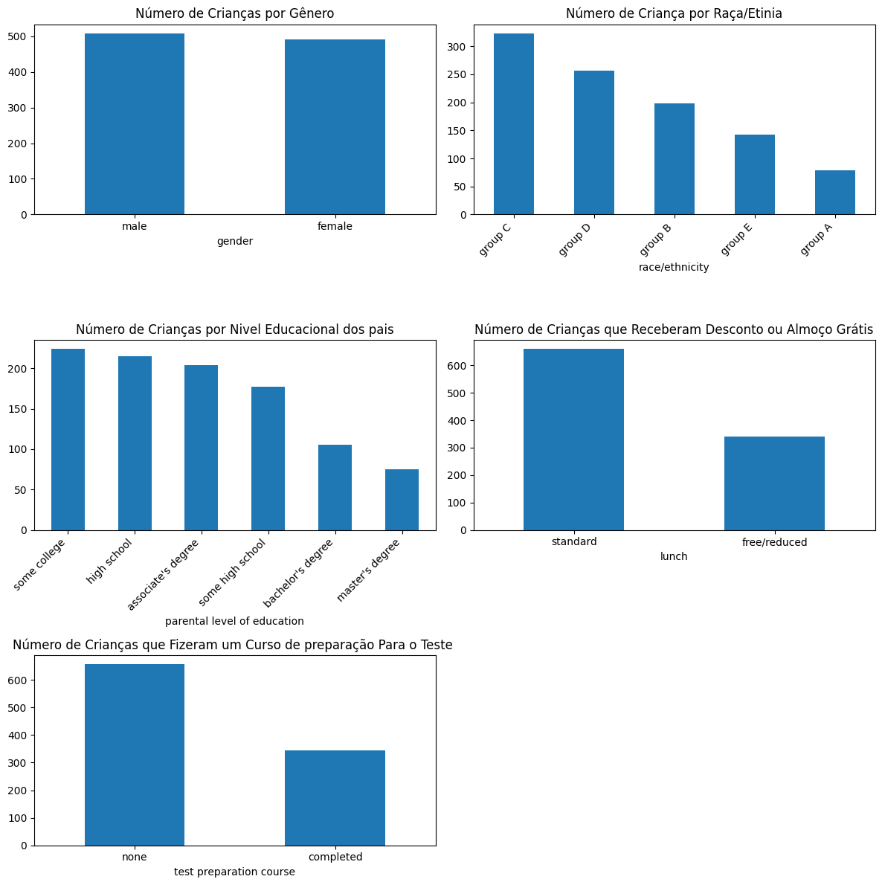

## Previsão de desempenho dos alunos

O conjunto de dados usados aqui foram extraídos de https://www.kaggle.com/datasets/rkiattisak/student-performance-in-mathematics/data e contêm informações sobre o desempenho dos alunos do ensino médio em matemática, incuindo informações demográficas. Os dados, originalmente, foram coletados em três escolas dos EUA. 

